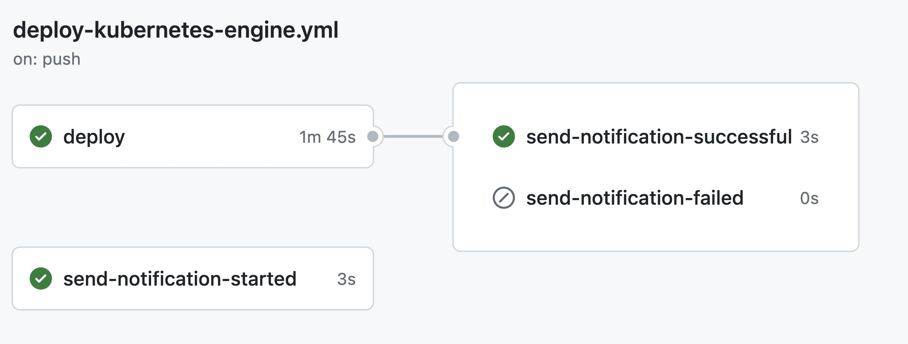

# Kubernetes Engine CI/CD Template

This repository contains code for a basic Node.js server setup along with Kubernetes deployment configurations and a CI/CD workflow.

## Description

### `index.js`

The `index.js` file sets up a simple Node.js server using the `http` module. It listens on a specified port and responds with a "Hello, World!" message upon receiving a request.

### `Dockerfile`

The `Dockerfile` facilitates the Docker image creation process for the Node.js application. It defines the necessary setup, dependencies installation, and exposes the specified port for communication.

### `deployment.yaml`

The `deployment.yaml` file contains Kubernetes configurations:

- **Deployment**: Specifies the setup for running multiple replicas of the application.
- **Horizontal Pod Autoscaler**: Automates scaling based on CPU utilization to maintain optimal performance.
- **Service**: Defines a service to expose the application, enabling external access via a Load Balancer.

### `.github/workflows/deploy-kubernetes-engine.yml`

This workflow automates deployment to Kubernetes:

- **Notifications**: Sends Telegram notifications on deployment start, success, or failure.
- **Deployment Steps**:
  - Checks out the code and sets up Google Cloud SDK.
  - Configures Docker CLI, builds, and pushes the Docker image to Google Container Registry.
  - Installs and configures `kubectl` for Kubernetes cluster access.
  - Deploys the application to Kubernetes using the configurations from `deployment.yaml`.

## CI/CD Workflow

The CI/CD workflow triggers on pushes to the `main` branch and consists of three main stages:

1. **Send Notification - Started**: Notifies the start of the deployment process.
2. **Deploy**: Executes the deployment process to Kubernetes, building and pushing the Docker image, and applying Kubernetes configurations.
3. **Send Notification - Successful/Failure**: Sends notifications based on the deployment result, informing about the success or failure status.

This setup provides a foundational structure for deploying a Node.js application to Kubernetes using Docker containers and automating the process through a CI/CD workflow.

Feel free to modify and expand upon this template as needed for your specific project requirements.
